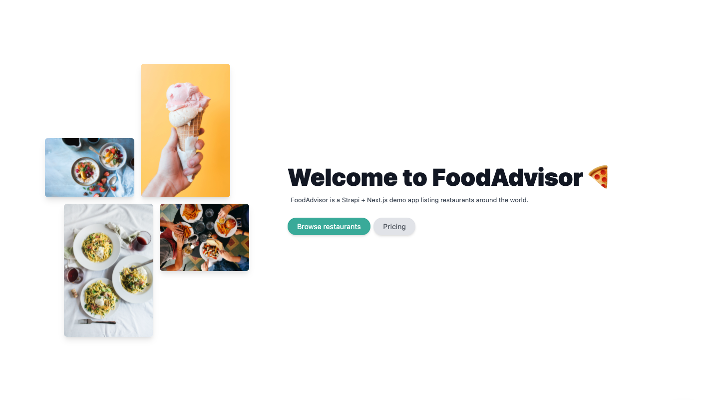

# FoodAdvisor - Strapi Demo



Welcome to FoodAdvisor, the official Strapi demo application.
This repository contains the following:

- Strapi project with existing Content-types and data (`/api`)
- Next.js client ready to fetch the content of the Strapi application (`/client`)

[](http://gitpod.io/#https://github.com/strapi/foodadvisor)

## Get started

You can get started with this project locally on your machine by following the instructions below or you can [request a private instance on our website](https://strapi.io/demo).

## Prerequisites

Be sure to have the correct env variables for each part:

- Strapi (example in `./api/.env.example`):
  - `STRAPI_ADMIN_CLIENT_URL=<url-of-nextjs>`
  - `STRAPI_ADMIN_CLIENT_PREVIEW_SECRET=<a-random-token>`

- Next.js (already in `./client/.env.development`):
  - `NEXT_PUBLIC_API_URL=<url-of-strapi>`
  - `PREVIEW_SECRET=<the-same-random-token-as-for-strapi>`

## 1. Clone FoodAdvisor

- Clone the repository by running the following command:

```
git clone https://github.com/strapi/foodadvisor.git
```

- Navigate to your project folder by running `cd foodadvisor`.

## 2. Start Strapi

Navigate to your `./my-projects/foodadvisor/api` folder by running `cd api` from your command line.

- Run the following command in your `./foodadvisor/api` folder:

```
yarn && yarn seed && yarn develop
```

This will install the dependencies, fill your application with data and run your server. You can run these commands separately.

#### Credentials

- Super Admin:
  - email: admin@strapidemo.com
  - password: welcomeToStrapi123

- Editor
  - email: editor@strapidemo.com
  - password: welcomeToStrapi123

- Author
  - email: author@strapidemo.com
  - password: welcomeToStrapi123

## 3. Start Next.js

Navigate to your `./my-projects/foodadvisor/client` folder by running `cd client` from your command line.

- Run the following command in your `./foodadvisor/client` folder

```
yarn && yarn dev
```

This will install the dependencies, and run your server. You can run these commands separately.

## Features overview

### User

<br />

**An intuitive, minimal editor** The editor allows you to pull in dynamic blocks of content. It’s 100% open-source, and it’s fully extensible.<br />
**Media Library** Upload images, video or any files and crop and optimize their sizes, without quality loss.<br />
**Flexible content management** Build any type of category, section, format or flow to adapt to your needs. <br />
**Sort and Filter** Built-in sorting and filtering: you can manage thousands of entries without effort.<br />
**User-friendly interface** The most user-friendly open-source interface on the market.<br />
**SEO optimized** Easily manage your SEO metadata with a repeatable field and use our Media Library to add captions, notes, and custom filenames to optimize the SEO of media assets.<br /><br />

### Global

<br />

[Customizable API](https://strapi.io/features/customizable-api): Automatically build out the schema, models, controllers for your API from the editor. Get REST or GraphQL API out of the box without writing a single line of code.<br />
[Media Library](https://strapi.io/features/media-library): The media library allows you to store your images, videos and files in your Strapi admin panel with many ways to visualize and manage them.<br />
[Role-Based Access Control (RBAC)](https://strapi.io/features/custom-roles-and-permissions): Role-Based Access Control is a feature available in the Administration Panel settings that let your team members have access rights only to the information they need.<br />
[Internationalization (i18n)](https://strapi.io/features/internationalization): Internationalization (i18n) lets you create many content versions, also called locales, in different languages and for different countries.<br />
[Audit Logs](https://strapi.io/blog/reasons-and-best-practices-for-using-audit-logs-in-your-application)The Audit Logs section provides a searchable and filterable display of all activities performed by users of the Strapi application<br />
[Data transfer](https://strapi.io/blog/importing-exporting-and-transferring-data-with-the-strapi-cli) Streams your data from one Strapi instance to another Strapi instance.<br />
[Review Worfklows](https://docs.strapi.io/user-docs/settings/review-workflows) Create and manage any desired review stages for your content, enabling your team to collaborate in the content creation flow from draft to publication. <br />


## Resources

[Docs](https://docs.strapi.io) • [Demo](https://strapi.io/demo) • [Next.js Starter](https://github.com/strapi/nextjs-corporate-starter) • [Forum](https://forum.strapi.io/) • [Discord](https://discord.strapi.io) • [Youtube](https://www.youtube.com/c/Strapi/featured) • [Try Enterprise Edition](https://strapi.io/enterprise) • [Strapi Design System](https://design-system.strapi.io/) • [Marketplace](https://market.strapi.io/) • [Clou Free Trial](https://cloud.strapi.io) 
